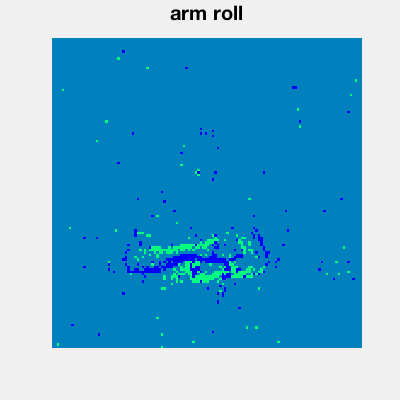
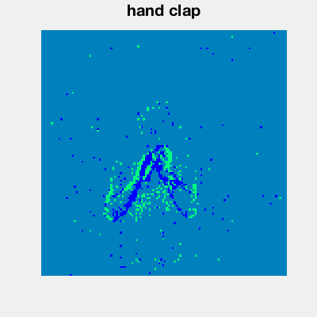

# Neuromorphic sensing and applications

[Download the slides here](slides/W8-V2-sensing-and-applications.pptx)

:::{iframe} https://www.youtube.com/embed/Uwht2Y6xLj4
:width: 100%
:::
---

:::{attention} Note!
In this section we’re going to just do a very quick introduction to some of the neuromorphic sensing devices and how they enable unique low power applications.
:::

## Why do we need neuromorphic sensing?

So let’s start by asking why would we even need specific neuromorphic sensing devices?
Couldn’t we just take the output of a standard camera for example, convert that to spikes and then feed it into a neuromorphic computing device? Well yes, but if we start thinking about the amount of data transfer involved, we can start to see a problem.
High definition video at 30 fps generates about 178 megabytes per second of data.

```{math}
\begin{gather}
&&\text{\textcolor{#0f73bf}{HD Video:}}\\
&&\text{30fps x (1920 x 1080) pixels x 8 bits/channel x 3 channels}\\
&&\text{= \textcolor{#d61a1a}{178 MB/sec}}
\end{gather}
```

That’s not too bad, but when we move to ultra high def with high dynamic range we’re now talking about 7 gigabytes per second.
On low power devices, that’s very problematic!

```{math}
\begin{gather}
\text{\textcolor{#0f73bf}{8k UHD with HDR:}}\\
\text{60fps x (7680 x 4320) pixels x 10 bits/channel x 3 channels}\\
\text{= \textcolor{#d61a1a}{7 GB/sec}}
\end{gather}
```

Event cameras are one solution to this problem. They noted that most pixels don’t change very much in a scene from frame to frame. That’s also the basis of video compression algorithms. Event cameras take this to the level of sensing. They only transmit an event when the underlying pixel changes.

```{math}
\begin{gather}
\text{\textbf{Event cameras} generate an event } (x,y,p) \\
\text{if pixel} (x,y) \text{ changes luminosity with sign } p 
\end{gather}
```

[These images](#dvsgd) are from the dynamic vision sensor gesture dataset, and give you an idea of what the output of these cameras looks like.

:::{figure}
:label: dvsgd
:align: center
:width: 250px

(dvsgd-arm-roll)=


(dvsgd-hand-clap)=


(dvsgd-left-hand-clockwise)=

:::

In addition to hugely reducing the amount of data transfer needed, it also has another nice effect. Instead of running at 60 frames per second we can run at the equivalent of thousands of frames per second with a much larger dynamic range.
The bad side is that the algorithm design is much harder, as we’ve seen throughout this course.

## Application: image deblurring by Prophesée

We just wanted to show one nice recent example of this from the French company Prophesée who are using a hybrid of standard cameras and event cameras on a mobile phone to remove blur from fast moving images.
You can see in [this video](#prophesee-vid) how the high frame rate of the event camera allows you to see the motion at a much higher temporal resolution.
They then use this to remove blur from the pixels that change fastest, and get a much nicer image as a result.

:::{figure} figures/SensingMedia1.mp4
:label: prophesee-vid
:align: center
:width: 100%
:::

## Other neuromorphic sensing devices

Vision isn’t the only sense that has a corresponding neuromorphic version.
There are auditory sensors, for example you can see [here](#silicon-cochela) some of the spikes produced by this system.

:::{figure} figures/SensingPicture4.png
:label: silicon-cochela
:align: center
:width: 400px
:::

And there are also olfactory sensors – the  sense of smell – and tactile sensors – the sense of touch.

## Robotics

We're going to finish this week with one nice robotics application from Katie Schuman.
She used this [robotic car](#robotic-car), controlled with the **mu Caspian neuromorphic computing device**.

:::{figure} figures/SensingPicture5.png
:label: robotic-car
:align: center
:width: 400px
:::

It was trained on a simulator of miniaturised formula 1 tracks like [these](#mini-tracks).

:::{figure} figures/SensingPicture6.png
:label: mini-tracks
:align: center
:width: 400px
:::

She used evolutionary algorithms which find some surprising and tiny networks that are able to do the task.

:::{figure} figures/SensingPicture7.png
:align: center
:width: 400px
:::

And finally, having trained it in a simulated environment, they tested it in this [previously unseen real world environment](#world-environment-track) and it was able to drive around the course. Well, some of the time.

:::{figure} figures/SensingPicture8.png
:label: world-environment-track
:align: center
:width: 400px
:::

```{seealso} That's it!
In these sections we’ve only touched the surface of the field of neuromorphic devices, but we hope that gives you some idea of the sort of the research that is being done in this field.
```